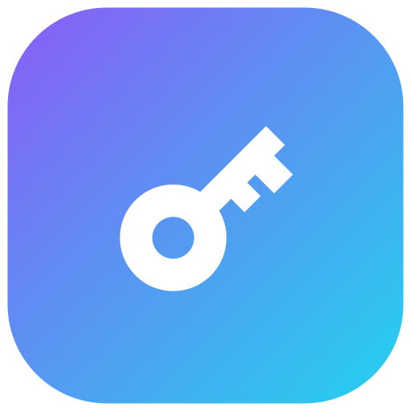

<p align="center"></p>

# NexoPass

Passwords derived from a master, nothing stored in plain text. For Android, Linux and Windows, and as the `nexopass` command on NixOS.

*Made by **Nexoniarz***

## How it works

Every password is computed, never saved:

```
password = Argon2id(master, site + version + type + login)
```

The same master gives the same password on every device. What NexoPass does store is the site list of each account (which sites, their current version, an archive of old versions), encrypted with a key derived from that account's master.

- **Accounts.** Several accounts, each with its own master and site list. Switch in one click.
- **App unlock.** A password or PIN (on the phone also a pattern and fingerprint/face) unlocks every account; a master is only typed to create or recover an account. Too many wrong tries remove it, and you recover with the master.
- **Data breach?** Rotate the site to a new version; the old one goes to the archive.
- **Passwords** of 5-15 words or 12-64 characters, chosen per site.
- **Typos** like "discrod" get a "did you mean discord?".
- **Export/import** with encrypted OpenPGP files, the same format everywhere, to move a site list between phone and PC.
- Clipboard cleared after a while (and hidden from KDE's clipboard history), auto-lock, screenshots blocked on the phone, no internet access at all.

## Download

Grab the files from [Releases](../../releases):

| | File |
|---|---|
| Android 8.0+ | `NexoPass-<version>-android.apk` |
| Windows | `NexoPass-<version>.msi` (installer) or `...-windows-portable.zip` |
| Debian/Ubuntu | `nexopass-gui_<version>_amd64.deb` |
| Fedora/openSUSE | `nexopass-gui-<version>.x86_64.rpm` |
| NixOS | see [nexoniarz-config-nixos](https://github.com/Nexoniarz/nexoniarz-config-nixos) |

The PC versions bring their own Java runtime: nothing else to install.

## The PC app and the `nexopass` command

On Linux the window and the command use the same files, so accounts, site lists and the app password are shared:

```
~/.local/share/nexopass/accounts/<name>/vault.gpg   site list
~/.local/share/nexopass/keyring.gpg + keyring.meta  app password
~/.config/nexopass/config                           settings
```

On Windows the same layout lives in `%APPDATA%\NexoPass`.

## Project layout

```
shared/     code both apps compile
  src/.../core/   passwords, vault, export (no UI)
  src/.../app/    app state and the platform interface
  src/.../ui/     Compose UI: every screen
  resources/      word list, license
android/    Android app: Keystore unlock, biometrics, file pickers
desktop/    Linux/Windows app (Compose Multiplatform): script-compatible storage
```

## Build

```
./gradlew :android:assembleRelease          # APK
./gradlew :desktop:run                      # run the PC app
./gradlew :desktop:packageDeb               # or packageRpm, packageMsi (on Windows)
./gradlew :desktop:test                     # passwords must match the script
```

GitHub Actions builds everything on each push; a `v*` tag publishes a release.

## Compatibility

`shared/src/.../core/Core.kt` must stay byte-for-byte compatible with the script: same Argon2id parameters, salts, word list (EFF Large Wordlist, checked by SHA-256), site-name rules and password layout. `CompatibilityTest` holds values produced by the script; changing any of them changes every password.

## License

Apache License 2.0, see [LICENSE](LICENSE) and [NOTICE](NOTICE).
